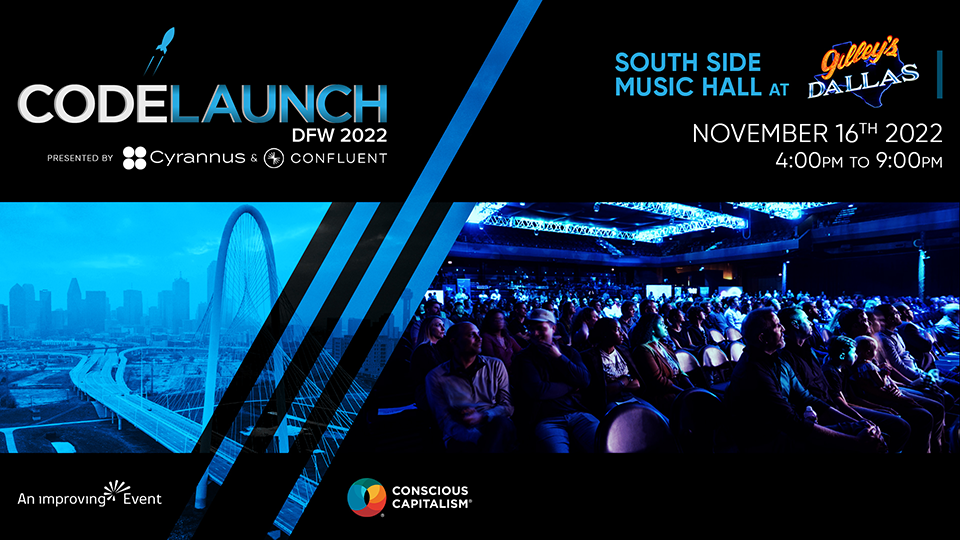

## Blogs/Articles

- [How to get started with user story mapping](https://www.christianstrunk.com/blog/how-to-get-started-with-user-story-mapping) // Christian Strunk
- [Ego Is the Enemy of Good Leadership](https://hbr.org/2018/11/ego-is-the-enemy-of-good-leadership) // Rasmus Hougard and Jacqueline Carter
- [Can GitHub's Copilot AI put the fun back into being a developer?](https://www.zdnet.com/article/can-githubs-copilot-ai-put-the-fun-back-into-being-a-developer/) // Liam Tung
- [A PDF Embed Web Component](https://www.raymondcamden.com/2022/10/02/a-pdf-embed-web-component) // Ray Camden
- [Web Component Experiment - Manipulating Inner Text](https://www.raymondcamden.com/2022/10/04/web-component-experiment-manipulating-inner-text) // Ray Camden
- [Empathy: The Secret Sauce in Good Design](https://improving.com/thoughts/empathy-the-secret-sauce-in-design) // Tony Brown
- [If No One Says No, Your Rate is Too Low](https://ardalis.com/if-no-one-says-no-your-rate-is-too-low/) // Steve Smith (Ardalis)

 

## Video

- [Containers From Scratch • Liz Rice • GOTO 2018](https://youtu.be/8fi7uSYlOdc) // GOTO Conferences // _Jun 29, 2018_
- [A couple of cool things you can do with CSS position sticky](https://youtu.be/8TyoihVGErI) // Kevin Powell // _Apr 03, 2019_
- [Introduction to the Intersection Observer JavaScript API](https://youtu.be/T8EYosX4NOo) // Kevin Powell // _Jun 12, 2019_
- [Work Your Network: Leveraging the Strength Behind Professional Relationships (Amy Fair)](https://youtu.be/PfuITCiIDwQ) // Dennis Shiao // _Dec 10, 2020_
- [3 awesome tools for a better front-end dev experience](https://youtu.be/CB3wsw0UCVc) // Kevin Powell // _Nov 30, 2021_
- [The QUIC Protocol, HTTP3, and How HTTP Has Evolved](https://youtu.be/VONSx_ftkz8) // TheDataDaddi // _Feb 28, 2022_
- [The right way to Docker Compose 🐳 🐙](https://youtu.be/hyJ2oPyaHkY) // Alex Ziskind // _Sep 12, 2022_
- [5 Things Successful Developers Do (That You Don't)](https://youtu.be/7MWmIhfvnes) // James Q Quick // _Sep 13, 2022_
- [Catch SQL Injection Vulnerabilities](https://youtu.be/TBk1n1O6Kmc) // GitHub // _Sep 14, 2022_
- [Type Aliases in Typescript](https://youtu.be/Dzn5BjAcCB0) // Hitesh Choudhary // _Sep 15, 2022_
- [Is Figma Dead? - Penpot, the Open Source Figma Alternative](https://youtu.be/pj7D0tSNmEg) // LevelUpTuts // _Sep 15, 2022_
- [Keynote - The Next Decade of Software Development - Richard Campbell - NDC Melbourne 2022](https://youtu.be/reL-ke2J03o) // NDC Conferences // _Sep 19, 2022_
- [Container Queries are going to change how we make layouts](https://youtu.be/3_-Je5XpbqY) // Kevin Powell // _Sep 20, 2022_
- [New CSS Units! Query units explained](https://youtu.be/ZSaAHb5dRwQ) // Kevin Powell // _Sep 22, 2022_
- ["Cache Rules Everything Around Me" By Matt Groves (Couchbase)](https://youtu.be/5DCxTuFASzo) // Sam Nasr // _Sep 23, 2022_
- [Mike Benkovich on Infrastructure as Code [TECHNOLOGYANDFRIENDS 722]](https://youtu.be/GX1lJ1dSJVY) // Technology and Friends // _Sep 23, 2022_
- [CEO or Creator or Engineer??? Ex-Twitch YC Founder Reflects on a Harris Heller video...](https://youtu.be/99eLybGBqgk) // Theo - ping․gg // _Sep 24, 2022_
- ["Expert Software Developers' Approach to Error" by Marian Petre (Strange Loop 2022)](https://youtu.be/UNMF5AS4SLg) // Strange Loop Conference // _Oct 03, 2022_
- [Unleash the Power of Visual Studio Code - Aaron Powell - NDC Melbourne 2022](https://youtu.be/I5kx__o4S3k) // NDC Conferences // _Oct 17, 2022_
- [Adding a BETTER way to loop in C#](https://youtu.be/jmmz1cInNow) // Nick Chapsas // _Oct 17, 2022_
- [JavaScript Garbage Collection is This SLOW????](https://youtu.be/ip51Y5v3WLk) // ThePrimeagen // _Oct 17, 2022_
- [Targeting Linux with .NET 6/7 and WSL (Windows Subsystem for Linux) on Windows 11](https://youtu.be/fD6DqryXA0w) // Scott Hanselman // _Oct 17, 2022_
- [Deconstructing the DevOps Hype - Improving Talks Series](https://youtu.be/WnUi4UYhdPs) // Improving // _Oct 14, 2022_

## Code Repos // Cool Projects

- [Lucide Icons](https://github.com/lucide-icons/lucide) // Beautiful & consistent icon toolkit made by the community. Open-source project and a fork of Feather Icons.
- [Dragonfly](https://github.com/dragonflydb/dragonfly) // A modern replacement for Redis and Memcached

