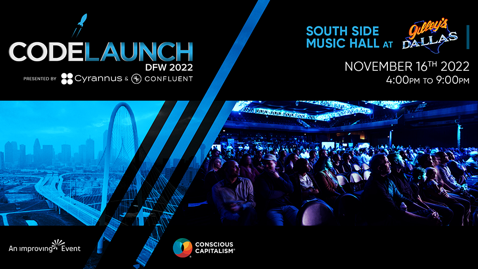

## Blogs/Articles

- [5 tips that will supercharge your Node.js microservices development](https://www.architect.io/blog/2022-10-25/5-tips-that-will-supercharge-your-node-js-microservices-development/) // Lee Brandt
- [To Tailwind or Not To Tailwind—That is the Question](https://www.telerik.com/blogs/tailwind-not-tailwind-question) // Alyssa Nicoll
- [GitHub Actions from CLI](https://ardalis.com/github-actions-from-cli/?utm_sq=h3hgsi6k7q) // Steve Smith
- [How ImprovingU Helps Improve You](https://improving.com/thoughts/how-improvingu-helps-improve-you) // Zack Kelly
- [What’s New In DevTools: Halloween Edition](https://www.smashingmagazine.com/2022/10/devtools-updates-halloween-edition/) // Patrick Brosset

 

## Video

- [Are events in C# even relevant anymore?](https://youtu.be/NmmpXcMxCjY) // Nick Chapsas // _Mar 17, 2022_
- [Refactor First - Improving Talks Series](https://youtu.be/lI_sRZt-llI) // Improving // _Aug 22, 2022_
- [Software development and us, the way we have evolved together - Improving Talks Series](https://youtu.be/CN2LdEkwykw) // Improving // _Sep 13, 2022_
- [What is the NEW "file" keyword of C# 11?](https://youtu.be/xm8eQenL7wA) // Nick Chapsas // _Sep 26, 2022_
- [Thinking about running Docker on M2?](https://youtu.be/N7wzU3TlmcE) // Alex Ziskind // _Oct 05, 2022_
- [Why use a monorepo?](https://youtu.be/flbz_5aMikw) // Vercel // _Oct 05, 2022_
- [Keynote: Why web tech is like this - Steve Sanderson](https://youtu.be/3QEoJRjxnxQ) // NDC Conferences // _Oct 13, 2022_
- [Top 10 Javascript One Liners YOU MUST KNOW!](https://youtu.be/bbnkAV12Tig) // developedbyed // _Oct 15, 2022_
- [The Oneness of Product in Scrum - Improving Talks Series](https://youtu.be/aFN3rvHlDec) // Improving // _Oct 17, 2022_
- [State of CSS survey - What do I NOT know about CSS?](https://youtu.be/mQi2a7sYqgM) // Kevin Powell // _Oct 17, 2022_
- [Bicep: Deploy to Azure cloud without it being a pain in the Arm - Paul Glavich - NDC Melbourne 2022](https://youtu.be/9uKve5hq9kY) // NDC Conferences // _Oct 18, 2022_
- [Coding in the Cloud with GitHub Codespaces - Damian Brady - NDC Melbourne 2022](https://youtu.be/dgyk7zkttHI) // NDC Conferences // _Oct 18, 2022_
- [how to never write bug](https://youtu.be/X3jw1JVNdPE) // Fireship // _Oct 18, 2022_
- [How Git Can Power an Exciting Future for Content Management - Git Merge 2022](https://youtu.be/EJXUNmb8nxM) // GitHub // _Oct 18, 2022_
- [Learn How Git's Code Works - Git Merge 2022](https://youtu.be/i6-z1kFPl0U) // GitHub // _Oct 18, 2022_
- [React Hooks: Class Components vs. Functional Components & Opinions on When & Where to use them](https://youtu.be/1fItx3o4k_Q) // Andrew Connell - Voitanos // _Oct 18, 2022_
- [GitHub like a Boss - Michelle Mannering - NDC Melbourne 2022](https://youtu.be/czC2DcTHYxY) // NDC Conferences // _Oct 19, 2022_
- [Chasing the holy grail  Reusable Web Components and Design Tokens - Duncan Hunter](https://youtu.be/I2_-czgGAls) // NDC Conferences // _Oct 19, 2022_
- [Demystifying Azure AD, JWTs & OIDC - Graeme Foster - NDC Melbourne 2022](https://youtu.be/x79xykhpBNo) // NDC Conferences // _Oct 19, 2022_
- [NEW Firebase Features Just Dropped](https://youtu.be/eME0jNxgv-I) // Beyond Fireship // _Oct 19, 2022_
- [JWT! What is it good for? Absolutely everything! - Ben Dechrai - NDC Melbourne 2022](https://youtu.be/R1fCs2a2xXw) // NDC Conferences // _Oct 20, 2022_
- [You Don’t Need Kubernetes](https://youtu.be/H5sPGruv2yc) // Theo - ping․gg // _Oct 20, 2022_
- [How Regex in C# can kill your app](https://youtu.be/NOLn0QwGlEE) // Nick Chapsas // _Oct 20, 2022_
- [Integrate Jenkins in Postman](https://youtu.be/PAlEp2AmSl4) // Postman // _Oct 20, 2022_
- [Backyard Squirrelympics 3.0- The Summer Games](https://youtu.be/lg5wznn3IBE) // Mark Rober // _Oct 23, 2022_
- [Man vs the Machine: Intro to Machine Learning and AutoML - Improving Talks Series](https://youtu.be/S3N6tbvvRJI) // Improving // _Oct 24, 2022_

## Code Repos // Cool Projects

- [OpenFGA](https://github.com/openfga/openfga) // A high performance and flexible authorization/permission engine built for developers and inspired by Google Zanzibar
- [The Art of the Command Line](https://github.com/jlevy/the-art-of-command-line) // Master the command line, in one page
- [PowerShell](https://github.com/PowerShell/PowerShell) // PowerShell for every system!
- [Terrascan](https://github.com/tenable/terrascan) // Detect compliance and security violations across Infrastructure as Code to mitigate risk before provisioning cloud native infrastructure.
- [RxSwift](https://github.com/ReactiveX/RxSwift) // Reactive Programming in Swift
