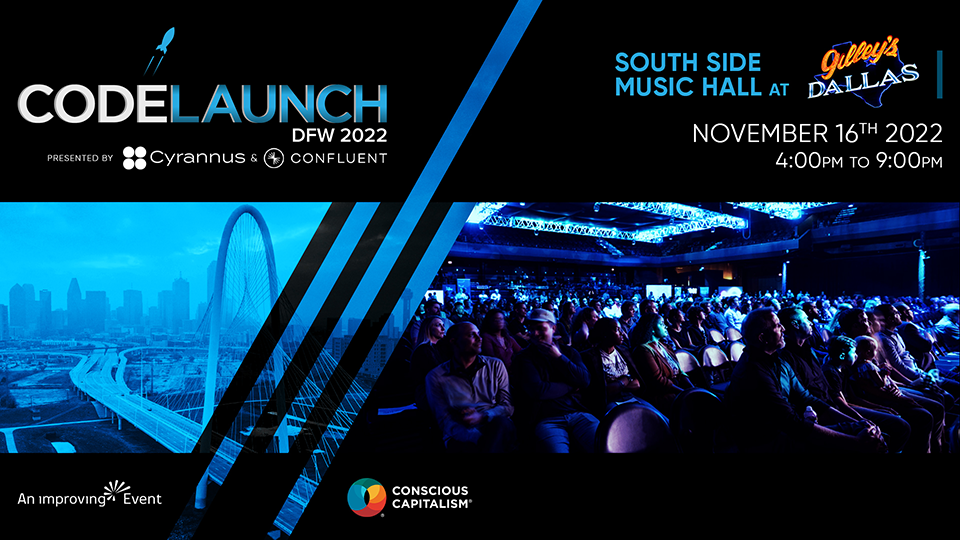

## Blogs/Articles

- [10 Awesome Github Repos Every Developer Must Know](https://levelup.gitconnected.com/10-awesome-github-repos-every-developer-must-know-c0b0839a17d3) // Simon Holdorf
- [Git’s database internals I: packed object store](https://github.blog/2022-08-29-gits-database-internals-i-packed-object-store/) // Derrick Stolee
- [How I Kept a Zero Email Inbox at Microsoft for 25 Years](https://jdmeier.com/inbox-zero-at-microsoft/) // JD Meier
- [Using Cloudinary with Alpine.js](https://www.raymondcamden.com/2022/10/27/using-cloudinary-with-alpinejs?utm_content=bufferbc4af&utm_medium=social&utm_source=linkedin.com&utm_campaign=buffer) // Raymond Camden
- [Hacking your dishwasher (or Cloudless Home-Connect Appliances)](https://trmm.net/homeconnect/) // Trammell Hudson
- [Understanding & Implementing Caching in ASP.NET Core](https://mitchelsellers.com/blog/article/understanding-implementing-caching-in-asp-net-core) // Mitchel Sellers
- [Creating a JWT Bearer Tokens](https://davidgiard.com/creating-a-jwt-bearer-token) // David Giard

 

## Video

- [Code Formatting with Prettier in Visual Studio Code](https://youtu.be/h3PJjP0nE98) // James Q Quick // _Jul 23, 2019_
- [Event-Driven Architectures Done Right, Apache Kafka • Tim Berglund • Devoxx Poland 2021](https://youtu.be/A_mstzRGfIE) // Devoxx Poland // _May 26, 2022_
- [The fastest way to cast objects in C# is not so obvious](https://youtu.be/dIu5EisoB_s) // Nick Chapsas // _Aug 29, 2022_
- [The INSANE performance boost of LINQ in .NET 7](https://youtu.be/zCKwlgtVLnQ) // Nick Chapsas // _Sep 05, 2022_
- [Why all your classes should be sealed by default in C#](https://youtu.be/d76WWAD99Yo) // Nick Chapsas // _Sep 12, 2022_
- [NO CODE GraphQL Server in Minutes using Grafbase](https://youtu.be/zkS4rnOpIlY) // James Q Quick // _Sep 27, 2022_
- [The border property you never knew you needed](https://youtu.be/ypstT5UfCsk) // Kevin Powell // _Oct 11, 2022_
- [CSS - The power of :has()](https://youtu.be/rvPZdV1aads) // Code with Dave // _Oct 15, 2022_
- [Introducing Spectre.Console](https://youtu.be/rXJ2p2Am_0I) // NimblePros // _Oct 19, 2022_
- [Unlock the value of open source with Open Sauced - Open Source Friday](https://youtu.be/BaIjOw1K5JY) // GitHub // _Oct 23, 2022_
- [Controlling your debugging experience in C#](https://youtu.be/yAaDn_-0rZY) // Nick Chapsas // _Oct 24, 2022_
- [Is JSON Blazingly Fast or...?](https://youtu.be/MuCK81q1edU) // ThePrimeagen // _Oct 24, 2022_
- [Easily test your site across all browsers](https://youtu.be/pRpsi1Z5YY0) // Kevin Powell // _Oct 25, 2022_
- [Graph Algorithms Crash Course (with Java)](https://youtu.be/dS44jZyj5gU) // freeCodeCamp.org // _Oct 26, 2022_
- [Next.js 13… this changes everything](https://youtu.be/_w0Ikk4JY7U) // Fireship // _Oct 26, 2022_
- [How to await ANYTHING in C#](https://youtu.be/ileC_qyLdD4) // Nick Chapsas // _Oct 27, 2022_
- [The thing people get wrong about flex-basis](https://youtu.be/jx4FtPlDXJg) // Kevin Powell // _Oct 27, 2022_
- [Visualizing a Call Tree with the Flame Graph](https://youtu.be/ROS3Pu8HeV8) // Microsoft Visual Studio // _Oct 27, 2022_
- [How We Built It: Git Workflows](https://youtu.be/VMhmRwuXfjA) // Postman // _Oct 28, 2022_
- [How to build docker image for nodejs apps](https://youtu.be/DQJNtDm5qy0) // Hitesh Choudhary // _Oct 28, 2022_
- [Navigating Data in Azure Cosmos DB Gremlin API - Sarah Dutkiewicz](https://youtu.be/w0Ag8mj-xFk) // CONDG // _Oct 28, 2022_
- [Photoshop 2023 NEW Features & Updates EXPLAINED!](https://youtu.be/wmDlaRv2alI) // Photoshop Training Channel // _Oct 28, 2022_
- [They DIDN'T Mention This??? React's ANNOYING new problem...](https://youtu.be/h_9Vx6kio2s) // Theo - ping․gg // _Oct 30, 2022_
- [The world's most used web app scanner - Open Source Friday](https://youtu.be/Ibti9SVpnX0) // GitHub // _Oct 30, 2022_
- [The second queue that EVERY message bus needs in .NET](https://youtu.be/5F3uQWomFMY) // Nick Chapsas // _Oct 31, 2022_
- [Amazing New VS Code Extension: Console Ninja](https://youtu.be/bmKDT-yG2eE) // Jack Herrington // _Oct 31, 2022_

## Code Repos // Cool Projects

- [Mastodon](https://github.com/mastodon/mastodon) // Your self-hosted, globally interconnected microblogging community
- [Algorithm Visualizer](https://github.com/algorithm-visualizer/algorithm-visualizer) // Interactive Online Platform that Visualizes Algorithms from Code
- [Home Assistant](https://github.com/home-assistant/core) // Open source home automation that puts local control and privacy first.
- [Pi Hole](https://github.com/pi-hole/pi-hole) // A black hole for Internet advertisements
