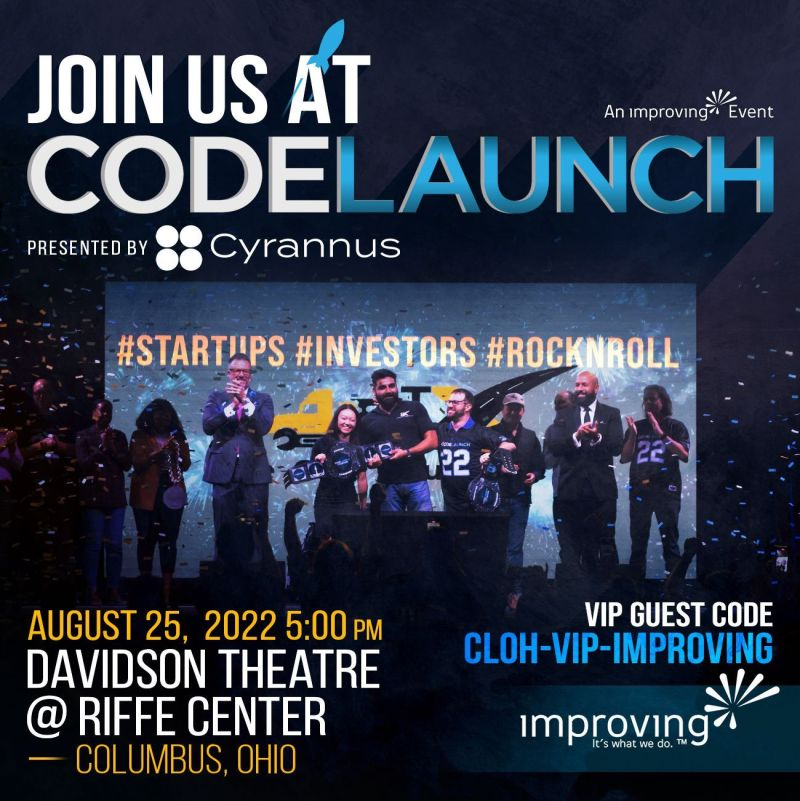

## Blogs/Articles

- [Interact with a GraphQL API from a .NET Core Application](https://www.thepolyglotdeveloper.com/2022/08/interact-graphql-api-dotnet-core-application/) // Nic Raboy
- [The easiest way to bundle a simple TypeScript web application](https://gist.github.com/danieldietrich/999abe1aaee11dcdf91d182807f7ee3f) // Daniel Dietrich
- [Free Azure Services?!](https://www.sadukie.com/2022/08/02/free-azure-services/) // Sadukie
- [Architecting Cloud Native .Net Applications for Azure](https://docs.microsoft.com/en-us/dotnet/architecture/cloud-native/) // Robert Vettor & Steve "Ardalis" Smith

## Video

- [Getting Started in Public Speaking - Improving Talks Series](https://youtu.be/Unb7JrbfPss) // Improving // _Jul 06, 2022_
- [Tim Urban: Inside the mind of a master procrastinator | TED](https://youtu.be/arj7oStGLkU) // TED // _Apr 06, 2016_
- [Dave Fancher - JavaScript Metaprogramming - NDC London 2022](https://youtu.be/mo0ukBw4nZE) // NDC Conferences // _Aug 02, 2022_
- [Inside LinkedIn’s New Hybrid Office With More Than 75 Seating Types | Open Office | WSJ](https://youtu.be/p_J3o8VU5rw) // Wall Street Journal // _Jul 05, 2022_
- [#Data as a #StoryTelling Mechanism](https://youtu.be/H7FWRQtzGvs) // FranksWorldTV // _Jul 27, 2022_
- [TensorFlow in 100 Seconds](https://youtu.be/i8NETqtGHms) // Fireship // _Aug 03, 2022_
- [Empowering Developers with Low Code Solutions - Amplication - Open Source Friday](https://youtu.be/FR9WWLusDlU) // GitHub // _Aug 06, 2022_
- [Testing your C# code reliably by freezing it in time](https://youtu.be/Q1_YkcPwpqY) // Nick Chapsas // _Aug 01, 2022_
- [Breaking Changes - "The Role of APIs in Successful Startups" with Desiree Vargas Wrigley, TechRise](https://youtu.be/7JEkqYrgcIA) // Postman // _Aug 07, 2022_
- [Drew Brown on The New Technology Employment Contract [TECHNOLOGYANDFRIENDS 712]](https://youtu.be/18_yWry8paw) // Technology and Friends // _Jul 22, 2022_
- [Making Good Tech Decisions - MY FIRST CONFERENCE TALK](https://youtu.be/Z0yZgqqy5Lc) // Theo - ping․gg // _Aug 05, 2022_

## Code Repos // Cool Projects

- [djschleen/devsecops-architecture-tools](https://github.com/djschleen/devsecops-architecture-tools) // A collection of diagramming tools to help create DevOps/DevSecOps reference architectures
- [tRPC](https://github.com/trpc/trpc) // Move Fast and Break Nothing. End-to-end typesafe APIs made easy.
- [VSCode Surround](https://github.com/yatki/vscode-surround) // A simple yet powerful extension to add wrapper templates around your code blocks
