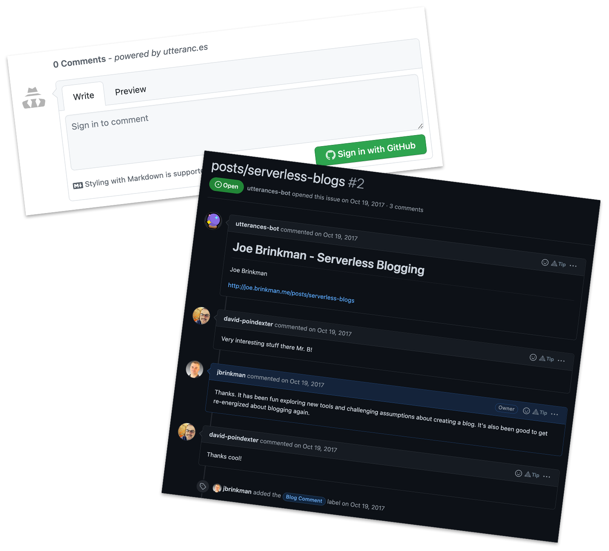

## Overview

In 2017 I relaunched my blog using a lightweight solution built around a static site generator and GitHub Pages. I detailed my blogging solution in the post [Serverless Blogging](https://joe.brinkman.me/2017/10/18/serverless-blogs/). Having written hundreds of blog posts over the last 20 years, I have a good sense of those features that I rely on, and those that I don't find very important for my needs. I used to believe that content management systems were great platforms for building blogs, but the reality is, blog content is fairly static. Once written, a blog really shouldn't change except for rare occurances where you need to fix typos or to correct mis-statements.

<!-- more -->

## Picking a Site Generator

Most static site generators require some level of coding skills in order to build or enhance the themes used for your site. Themes control aspects like when to show content in the sidebar, the colors and styles used on the site, how the navigation will work, etc. Anything having to do with the look and feel of the site is likely defined by the theme. If you want to have page elements that are interactive or that change from page to page, that will likely require some type of coding.

When I originally relaunched my blog, I was just coming off of 15 years of writing software using .Net in both VB and C#. Choosing a platform based on .Net was a natural fit as I felt very comfortable with my ability to maintain and enhance the platform as needed. Wyam was a popular open source .Net based static site generator at the time. I felt very comfortable jumping in and figuring out how it worked and how to extend the platform as needed to suit my needs.

In the last 5 years my life has changed substantially and for the past year I have spent most of my time writing code in NodeJS. Wyam is no longer a fully open source platform with the newest .Net core version transitioning to a paid licensing model. This seemed like the perfect opportunity to find a stable NodeJS based platform. I wanted to be able to keep the little bit of content I had created in Wyam so finding a generator that supported Markdown was high on my list of features.

After a short search I have settled on [Hexo](https://hexo.io/) as my new platform of choice. My content is still written in Markdown, so I can use pretty much any editor I choose (including the built in file editor on GitHub). Translating the old content from Wyam was just a matter of updating the front-matter for the blog posts. I didn't have a lot of content and didn't really care about maintaining URL format so the migration was fairly easy.

## Leave a Comment

As before, I decided to continue using [Utteranc.es](https://utteranc.es/), which works very well for my needs. All of my comments live in "issues" and are maintained by GitHub. I can trust their infrastructure to handle the basics, and if needed, I have full access to their API to write my own bots to screen out problematic comments or handle other comment management chores. This provides me a lot of flexibility and control over the comments and the commenting system. Utteranc.es is not supported out of the box, but litteraly

## Performance and Security

In 2017, GitHub did not have all of the features that it has today. GitHub Pages could host and serve static pages, but you didn't have control over the site URL/domain, and you didn't have the ability to serve pages via SSL/TLS. To solve this problem, I used [CloudFlare](https://www.cloudflare.com/) as a proxy for my GitHub hosted pages which provided me the ability to use a custom domain and to serve pages with HTTPS: instead of just HTTP:. Since then, GitHub has addressed these two deficiencies with GitHub Pages. I now have multiple options on how to configure Pages to use a domain of my choosing and to serve the content securely. These features have allowed me to drop CloudFlare from my site architecture which means I have one less piece of infrastructure I have to deal with. This lets me keep more of my process on GitHub which simplifies the overall architecture of the site.

## Publishing

Publishing my blog posts follows a similar workflow as it did when using Wyam. I write my blog post locally as markdown. Once my post is complete and everything looks good on my machine, I just check-in my new markdown file and any associated images. Previously, I had been using [AppVeyor](https://www.appveyor.com/) to monitor GitHub and to run the "publishing" step in Wyam whenever new files were added to the repository. Wyam would convert the markdown, images and use my configured theme to generate the final static site. The AppVeyor scripts would then check-in these files into the GitHub-pages branch of the repository which is what would actually get served to anyone coming to my site.

In October of 2018, GitHub launched [GitHub Actions](https://github.com/features/actions) which is a full automation system capable of handling almost any CI/CD requirements. Once again, I found another part of my site hosting services that I could migrate to GitHub infrastructure and remove one more external service from the mix. GitHub actions are written in a fairly standard YAML format which is comparable to many of the other CI/CD systems I have worked with.



## Wrapping it Up

Overall, I am very happy with the new platform. Like all software, there is a bit of a learning curve to get up and running. Once it is working, writing new blogs is pretty painless. Like Wyam before it, Hexo provides me a lot of flexibility to customize the system the way I like. I have full access to the source code and it has a nice plugin ecosystem so I don't feel I have to write every extension myself.

I enjoy blogging and the process of learning that blogging forces you to do in order to write a well thought out article. Part of the challenge is to just rebuild the habit that I built during more than 15 years of open source development. This post is just the latest brick in that rebuilding effort. Whether you are new to blogging, or have taken an extended break, I encourage you to go out and give it a try. The platforms that are available now are so much more sophisticated than what we had available 20 years ago when I wrote my first blog post. And what's even better, you can do it all for free, and someone else has to worry about keeping the servers up and running and you can spend all of your time just coming up with interesting things to write about.
